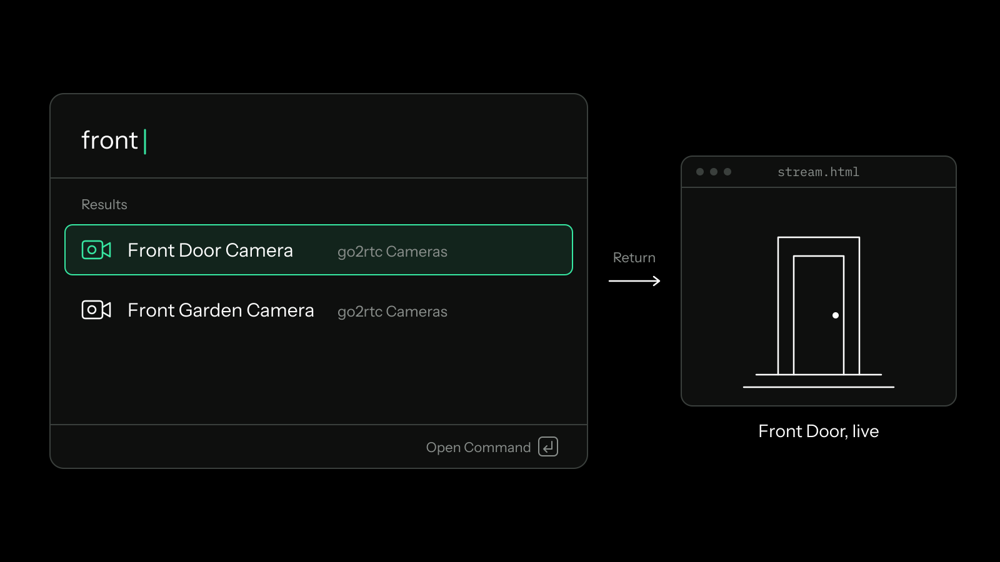
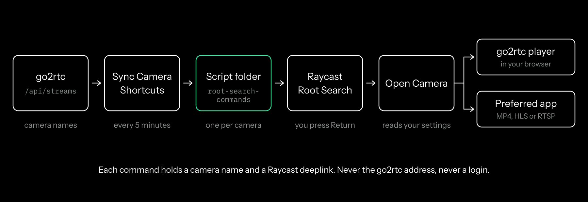

<p align="center">
  
</p>

<h1 align="center">go2rtc Cameras</h1>

<p align="center">A Raycast extension: type a camera's name, press Return, watch it live.</p>



## Getting started

go2rtc Cameras is not on the Raycast Store. You install it from source. You need Raycast, Node.js and npm, and a [go2rtc](https://github.com/AlexxIT/go2rtc) server your computer can reach.

1. **Install the extension.**

   ```sh
   git clone https://github.com/RainnWorks/raycast-go2rtc-cameras.git
   cd raycast-go2rtc-cameras
   npm install
   npm run dev
   ```

   `npm run dev` builds the extension and imports it into Raycast. Its commands appear in Root Search.
2. **Enter your go2rtc address.** Raycast asks for it the first time you run one of the commands. Use the address of the go2rtc WebUI, such as `http://192.168.1.10:1984`. If the WebUI uses HTTP Basic Auth, fill in **Username** and **Password** too.
3. **Run Sync Camera Shortcuts.** It writes one command per camera into a folder of its own, copies that folder's path, and opens the setup guide.
4. **Add the folder to Raycast. You do this once.** Open Raycast Settings with ⌘,. In the **Extensions** section choose **Script Commands**, then press **+** beside **Script Folders**. In the folder picker, press ⌘⇧G, paste the copied path and press Return. Select that exact `root-search-commands` folder, not Downloads and not its parent folder.
5. **Type a camera's name and press Return.** The camera opens in the go2rtc player in your browser. This first launch also tells the extension that setup worked, so later syncs stop opening the guide.

Raycast watches the folder, so there is nothing to import after step 4. New cameras appear in Root Search on their own.

## Use

The extension has four commands:

| Command | What it does |
|---|---|
| Sync Camera Shortcuts | Adds, updates and removes the camera commands to match go2rtc. It also runs by itself every five minutes. |
| Browse Cameras | Lists every go2rtc stream, with its open connections, and every way to open or copy it. |
| Set Up Cameras in Root Search | Shows the folder path, the steps above, and when setup last worked. Use it to add the folder again. |
| Open Camera | Opens one camera by its go2rtc name. The camera commands run it for you. |

A stream called `front_door` appears in Root Search as **Front Door Camera**. go2rtc often has a smaller `_sub` stream beside each camera, such as `front_door_sub`. Root Search leaves these out when the main stream exists, so each camera appears once. Turn on **Include Substreams** to list them too, as **Front Door Camera — Substream**.

### Choose how cameras open

By default Return opens go2rtc's own player in your browser. It plays every codec go2rtc supports and needs no setup. To open cameras in IINA, VLC, mpv or another player instead:

1. Choose the app under **Preferred App**.
2. Choose a **Player Stream Format**:
   - **HTTP MP4** works through most reverse proxies. This is the default.
   - **HLS** is broadly supported but can add latency.
   - **RTSP** usually has the lowest latency. go2rtc's RTSP port, normally 8554, must be reachable from your computer.
3. Set **Default Action** to **Open Stream in Preferred App**.

Every camera command follows these settings at once, because the commands ask the extension what to do each time they run.

| Setting | Default | Options |
|---|---|---|
| go2rtc Address | none | The WebUI address. Required. |
| Username, Password | empty | HTTP Basic Auth for the WebUI. |
| Default Action | Open go2rtc Player in Browser | Or Open Stream in Preferred App |
| Preferred App | none | Any app. Without one, cameras open in the browser. |
| Player Stream Format | HTTP MP4 | HLS, RTSP |
| RTSP Address | the go2rtc host on port 8554 | Any `rtsp://` or `rtsps://` address |
| Pass Login to Player | off | Adds the WebUI login to the MP4 or HLS address given to the player |
| Include Substreams | off | Lists `_sub` streams in Root Search too |

For the go2rtc address you can paste a plain address, an address with a base path such as `https://example.test/rtc`, or a full `stream.html`, `links.html` or `api/streams` link. An address without `http://` or `https://` is read as `http://`. An address with a username or password in it is refused: use the **Username** and **Password** settings.

Leave **Pass Login to Player** off unless your player cannot ask for the login itself. When it is on, the login goes into the address the player opens, and media players can keep opened addresses in their history or logs.

In **Browse Cameras**, the actions for each camera are:

- **Open in Browser**, and **Open in** your preferred app if you chose one. The default action comes first.
- **Open Stream with…** (⌘⇧O) to pick a player just this once.
- **Open go2rtc Stream Details**, go2rtc's `links.html` page for the camera.
- **Sync Root Search Camera Commands** (⌘⇧E).
- **Copy Browser Link**, **Copy Player Link**, **Copy RTSP Link**, **Copy HLS Link** and **Copy MP4 Link**. Copied links never contain the login.
- **Refresh Cameras** (⌘R) and **Open Extension Preferences**.

## How it works



A Raycast extension declares its commands in advance, so it cannot add one per camera itself. Raycast Script Commands can be added at any time, though: Raycast lists every script in a folder you approve. So the extension keeps its own folder of Script Commands, `root-search-commands` in its Raycast support folder, with one script per camera.

Sync asks go2rtc for `/api/streams`. That is the only request it makes; it never asks for go2rtc's configuration. Some go2rtc setups put upstream camera addresses in that response, so the extension reads it in memory, keeps only the stream names and connection counts, and never logs or stores the rest.

Each script holds a camera name and a Raycast deeplink to **Open Camera**, nothing else. The go2rtc address and your login are never written into the scripts. They stay in the extension's settings, and Raycast keeps the password as a secure preference. When a script runs, **Open Camera** reads the settings and builds the address then.

Sync is careful about what it deletes:

- If go2rtc cannot be reached or returns an error, the scripts stay as they are.
- A camera removed from go2rtc loses its script at the next successful sync.
- If go2rtc returns an empty stream list, every camera script is removed.
- It only deletes files it made itself. Each one is named `go2rtc-camera-…` and carries a marker line inside.

Raycast does not let an extension read your Script Folders list. So the extension does not claim setup worked until a camera script actually runs. The first time one does, **Open Camera** records it, and Sync Camera Shortcuts stops opening the guide.

## Limits

- **Not on the Raycast Store.** You install and update it from source.
- **One manual step.** Raycast does not let an extension add a Script Folder for you, so step 4 is yours.
- **It cannot see the folder being removed.** If you later take the folder out of Raycast Settings, the extension cannot tell. Run **Set Up Cameras in Root Search** and add it again.
- **Root Search can be up to five minutes behind go2rtc.** Run **Sync Camera Shortcuts** to catch up at once. The background sync fails silently.
- **Setup is written for a Mac.** The extension also targets Windows, where it writes PowerShell scripts instead, but the setup guide gives Mac keys and uses Finder.
- **go2rtc should not be open to the internet.** Reach it through a private network, or put it behind authentication and TLS.

## Build from source

```sh
npm install
npm test
npm run typecheck
npm run lint
npm run build
```

`npm run dev` loads your working copy into Raycast.

The README artwork and the icon are rendered from `assets/src/`. See [`assets/src/README.md`](assets/src/README.md).

`CHANGELOG.md` follows the Raycast Store format, ready for a Store submission with `npm run publish`.
